<h2><u>Compte Rendu</u></h2>
<h4>compte rendu sur l'utilisation des web services tel que:
<ul>
<li>SOAP</li>
<li>REST avec Jersey</li>
<li>RestController</li>
<li>Spring Data Rest</li>
<li>GraphQL </li>
</ul>
 </h4>
<ul>

<li>
</li>
<h3>REST avec Jersey</h3>
    <ol> 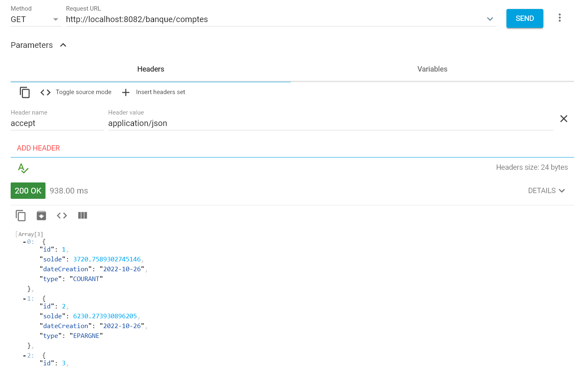</ol>
    <ol style="text-align: center"><strong style="color: red">Figure 1: </strong> La liste des Comptes en Format JSON</ol> 
    <ol> 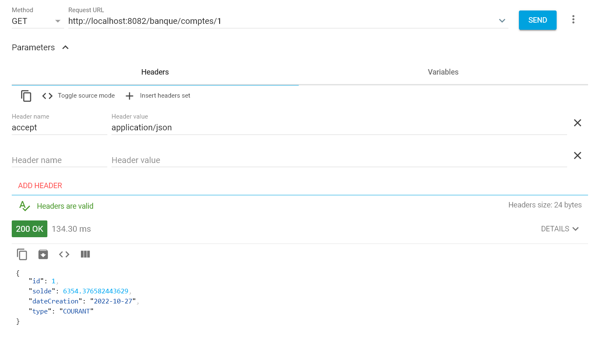</ol>
    <ol style="text-align: center"><strong style="color: red">Figure 2: </strong>Un Compte </ol> 
    <ol> 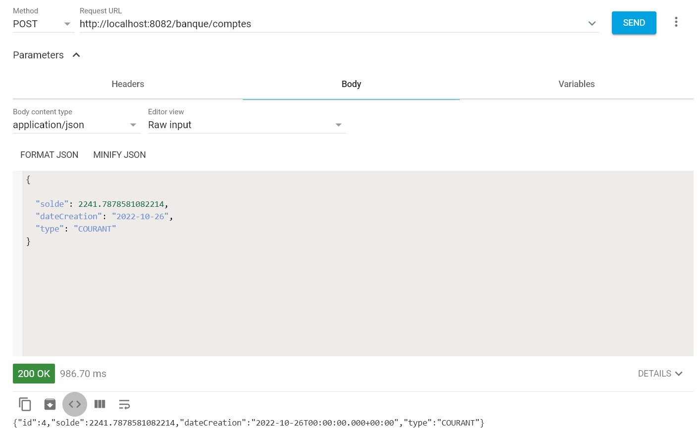</ol>
    <ol style="text-align: center"><strong style="color: red">Figure 3: </strong>Ajouter un Compte</ol> 
     <ol> 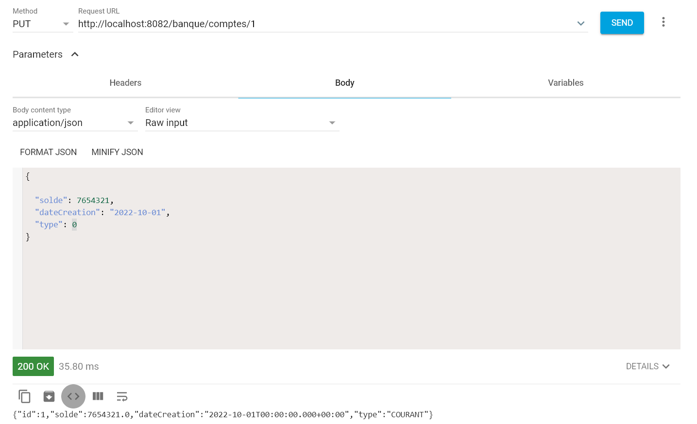</ol>
    <ol style="text-align: center"><strong style="color: red">Figure 4: </strong>Modifier un Compte</ol> 
 <ol> 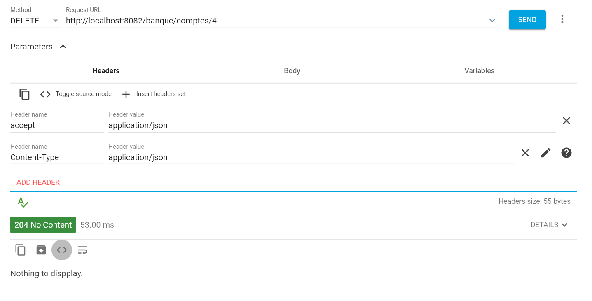</ol>
    <ol style="text-align: center"><strong style="color: red">Figure 5: </strong>Supprimer un Compte</ol> 

<h3>RestController</h3>
<ol> 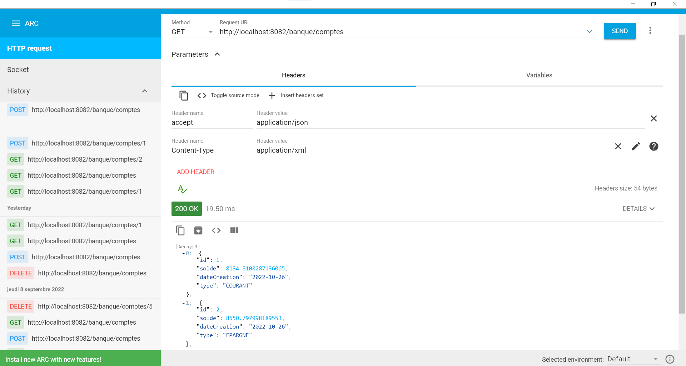</ol>
    <ol style="text-align: center"><strong style="color: red">Figure 6: </strong>La liste des Comptes en Format JSON</ol> 
<ol> 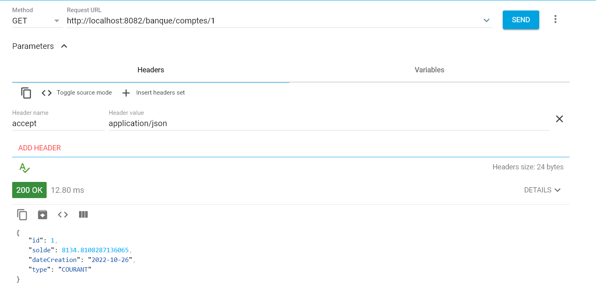</ol>
    <ol style="text-align: center"><strong style="color: red">Figure 7: </strong>Un compte en Format JSON</ol> 
<ol> 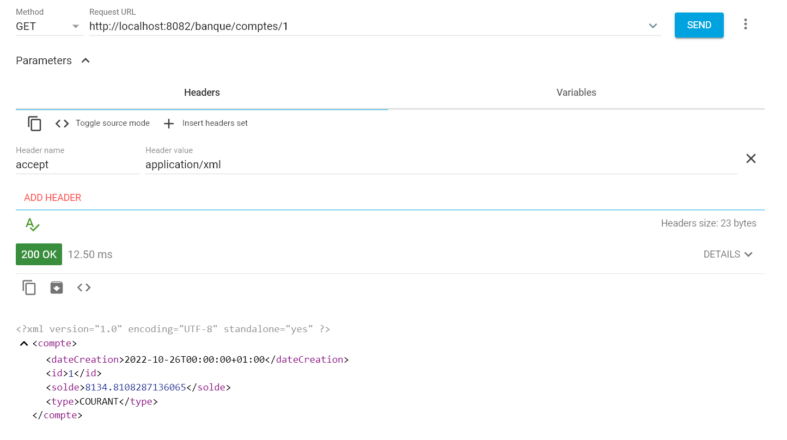</ol>
    <ol style="text-align: center"><strong style="color: red">Figure 8: </strong>Un compte en Format JSON</ol> 
<ol> 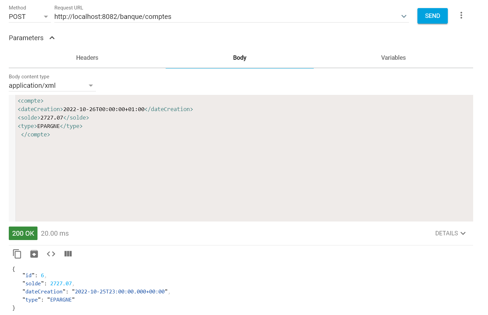</ol>
    <ol style="text-align: center"><strong style="color: red">Figure 9: </strong>Ajouter un compte avec une requête XML et une réponse JSON</ol> 
<ol> 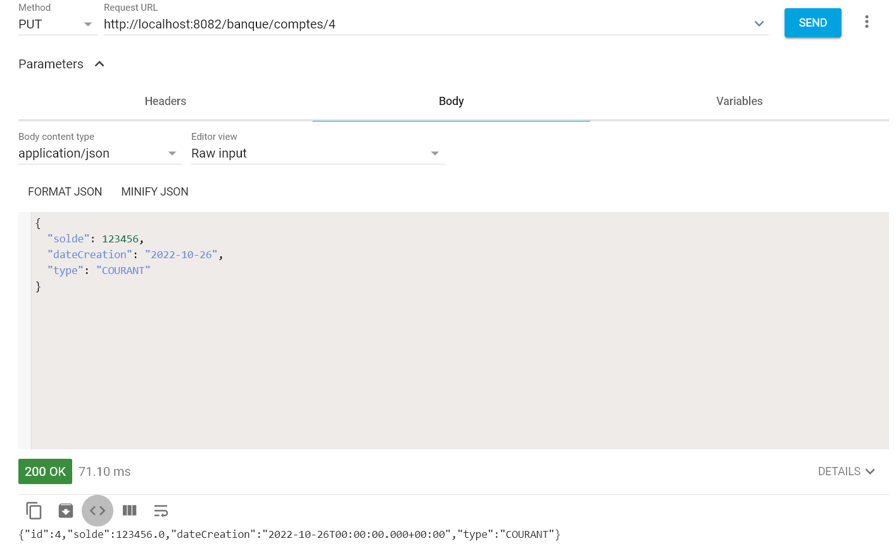</ol>
    <ol style="text-align: center"><strong style="color: red">Figure 10: </strong>Modifier un compte avec une requête et une réponse JSON</ol> 
<ol> 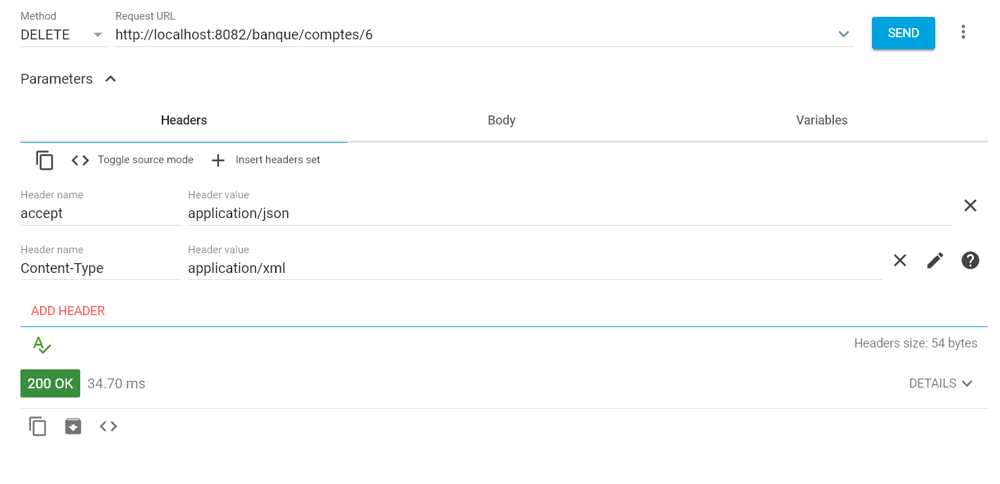</ol>
    <ol style="text-align: center"><strong style="color: red">Figure 11: </strong>Supprimer un compte</ol> 

<h3>SPRING DATA REST</h3>
<ol> 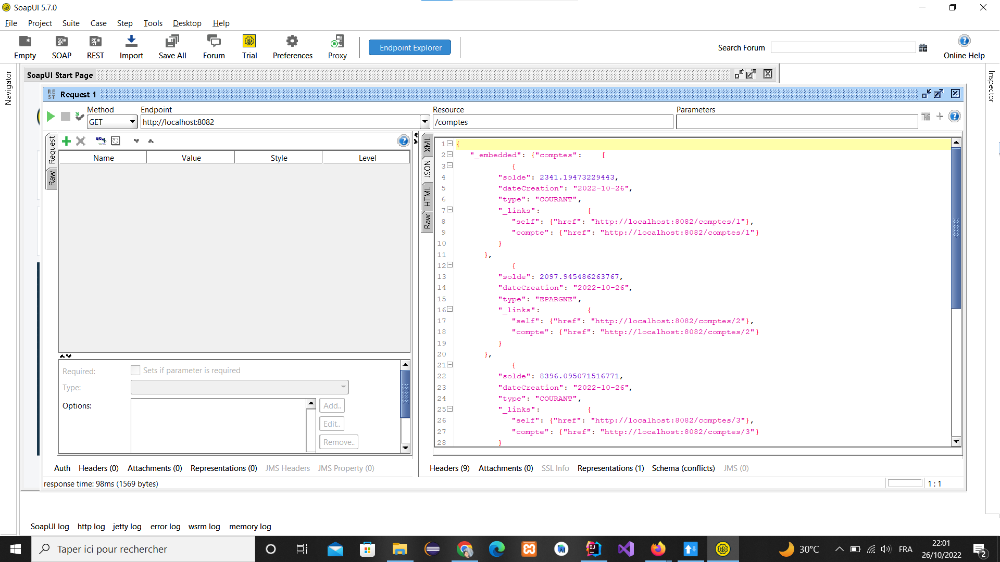</ol>
    <ol style="text-align: center"><strong style="color: red">Figure 12: </strong>La liste des Comptes en Format JSON</ol> 
<ol> 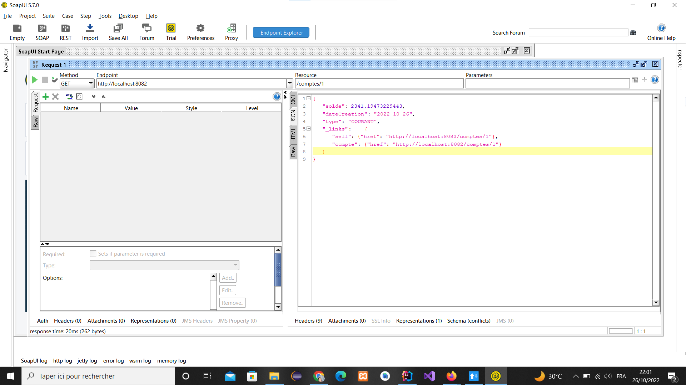</ol>
    <ol style="text-align: center"><strong style="color: red">Figure 13: </strong>Un compte en Format JSON</ol> 
<ol> 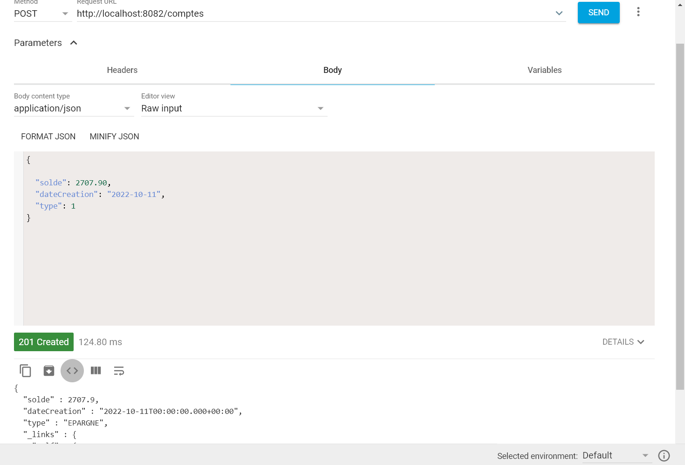</ol>
    <ol style="text-align: center"><strong style="color: red">Figure 14: </strong>Ajouter un compte avec une requête et une réponse JSON</ol> 
<ol> 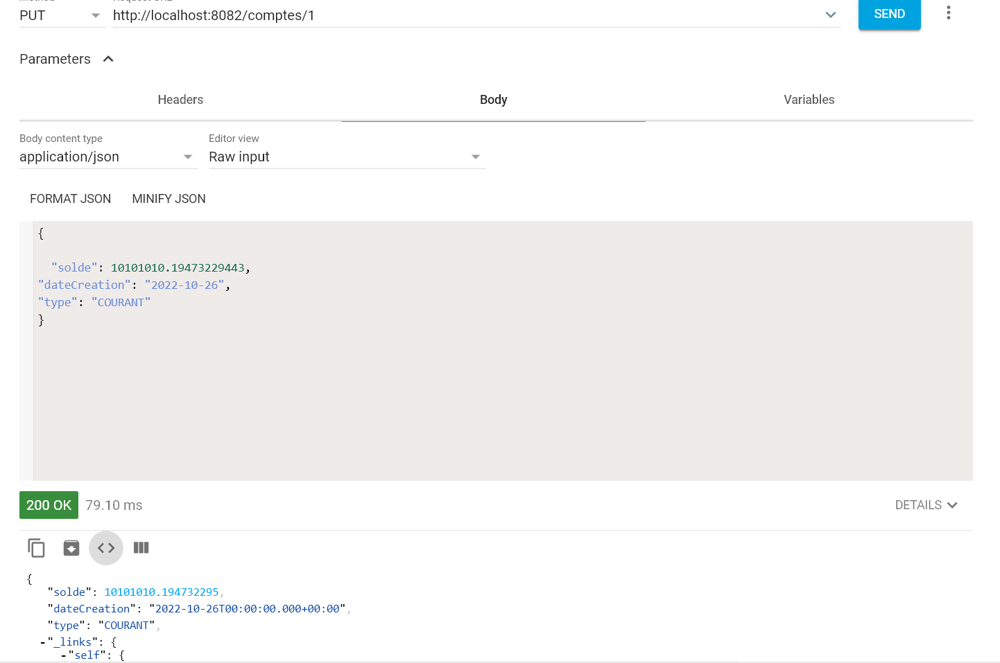</ol>
    <ol style="text-align: center"><strong style="color: red">Figure 15: </strong>Modifier un compte avec une requête et une réponse JSON</ol> 
<ol> 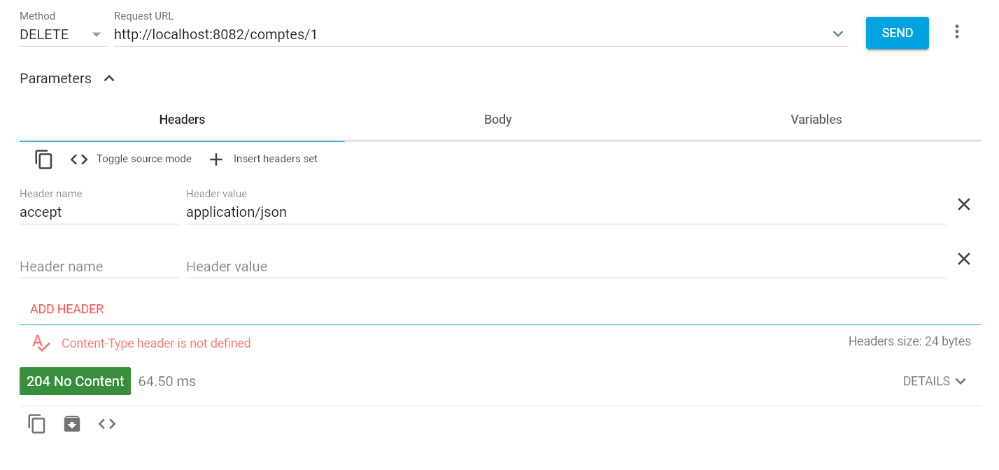</ol>
    <ol style="text-align: center"><strong style="color: red">Figure 16: </strong>Supprimer Un compte</ol> 

<h3>GraphQL</h3>
<ol> 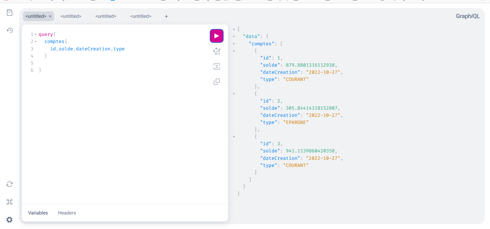</ol>
    <ol style="text-align: center"><strong style="color: red">Figure 17: </strong>La liste des Comptes en Format JSON</ol> 
<ol> 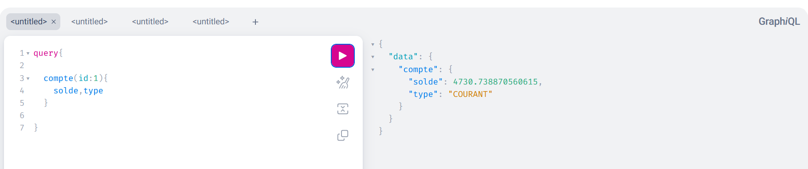</ol>
    <ol style="text-align: center"><strong style="color: red">Figure 18: </strong>Un compte en Format JSON</ol> 
<ol> 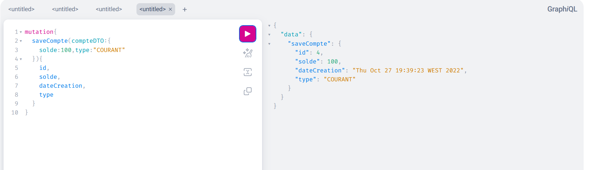</ol>
    <ol style="text-align: center"><strong style="color: red">Figure 19: </strong>Ajouter un compte avec une réponse JSON</ol> 

</ul>
